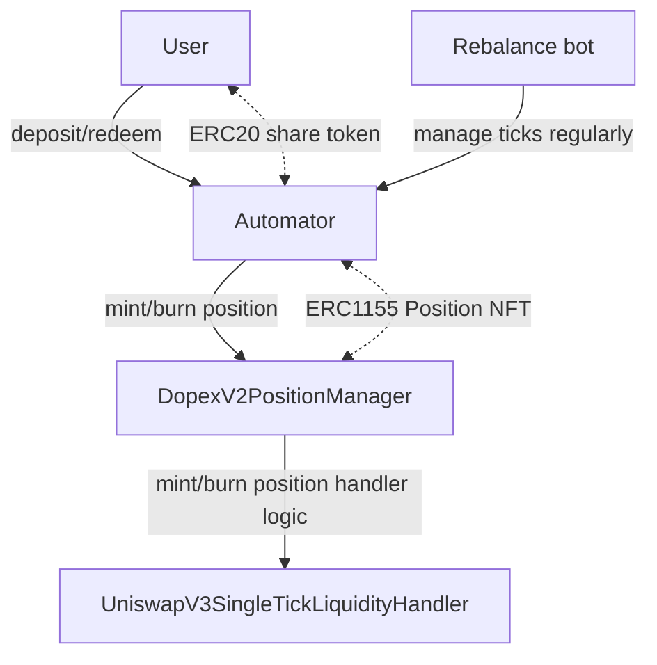

# Dopex V2 Automator

The contract to automate Dopex V2 position management.
Deposited funds are automatically allocated to the best performing ticks.

# Specification

## Overview



# Test Coverage

```
make coverage/html
```
